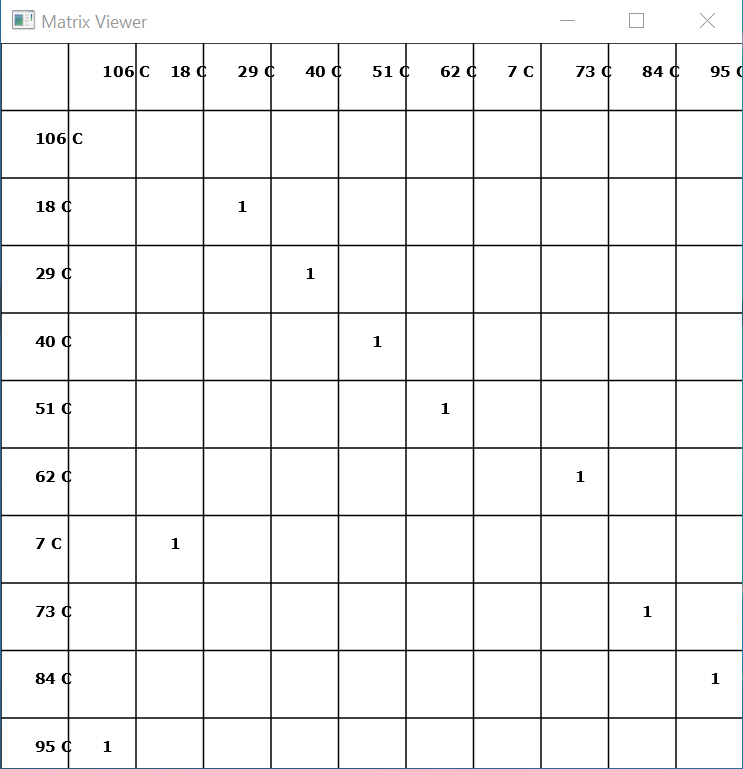

  

<h1>Bond-Electron Matrix Viewer for JavaFX 12</h1>
This is a Bond-Electron Matrix viewer for JavaFX 12.

<h2>Purpose</h2>
Easily visualize a Bond-Electron Matrix created by the Parser.

<h2>Usage</h2>
Place a valid BE-Matrix json file in your filesystem at the location specified in Line 287 of App.java. (Modify this URL to match your local machine)

<h2>Compilation</h2>
To run, enter this on the command line: mvn clean compile package javafx:run

<h2>Data File Generation</h2>
BE-Matrix json files are generated by another Project Umami application currently under construction.  This application will be announced in the future.

<h2>Information</h2>
For more information about Project Umami, visit http://twitter.com/ProjectUmami

<h2>Contact</h2>
For more information, contact inquiries@orchidwarestudios.com or call 619-665-1703.

<h2>Contributors</h2>
Project Umami's Matrix Viewer is an open-source, LGPL project and is seeking contributors from the scientific and engineering communities. If interested, please contact inquiries@orchidwarestudios.com
